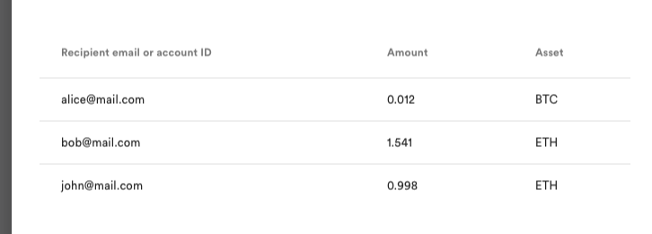

# Create a CSV file for mass transfer

**CSV** file for mass transfers contain the following information: 

1.  **email** or **account id** of the recipient
1.  **amount **of transfer
1.  code of the **asset**

You can compose **CSV** files with the help of text editors such as Microsoft Excel, OpenOffice Calc, Notepad, or Google Docs. 

Your document may look as follows: 

_**Note:** save your file with the **CSV** extension and [upload the file](./Mass-transfers.md) to the platform._
